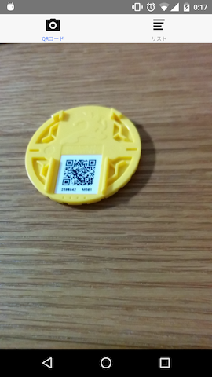
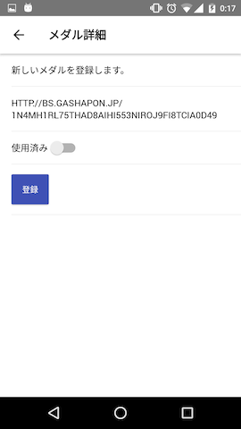
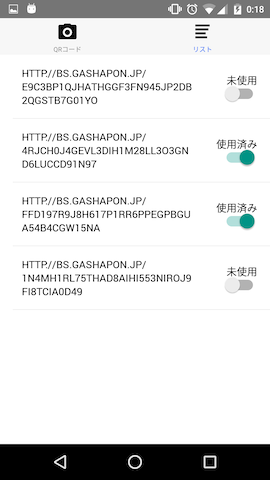

# BS Medal Marker

React Nativeの練習用に作ったアプリ。

BANDAIのアーケードゲーム"[仮面ライダー ブットバソウル](http://bs.gashapon.jp/)"のメダルを管理する。

想定ユーザーは、仮面ライダー好きの子をもつ親（作者もその一人）。

## ブットバソウルって？

- ガシャポンなどでメダルを買う。裏にQRコードが貼ってある。
- お店（デパートのゲームコーナーなど）に置いてあるゲーム機にQRコードを読み取らせると、仮面ライダーのゲームがプレイできる。
- 個々のQRコードは1回しか使えない（正確には、ゲームの筐体毎に1回しか使えない。別のお店ならまた1回使える）。

## このアプリでできること

- メダルを買い集めていると、どのメダルが使用済みなのか、だんだん分からなくなってくる。
- このアプリを使うと、カメラでQRコードを読み取り、メダルを一覧に登録できる。
- 個々のメダルは未使用/使用済みのスイッチが付いており、使用済みかチェックできる（お店毎にチェックできるのが望ましいが、今はそこまでの管理はできない））。
- あるメダルが使用済みなのか分からなくなったら、QRコードで読み取れば、そのメダルが既に一覧に登録済みか（そして使用済みか）が表示される。

## React Native周辺の使用技術

- react-native-camera: カメラ機能のライブラリ。
- NativeBase: React Native用のコンポーネント集。無難にオシャレな一通りのUI部品が揃っている。
- React Native Router Flux: 数あるルーティングのライブラリのうちの一つ。
- redux-persist: Reduxのstoreを永続化するライブラリ。メダル一覧の保存に利用している。

## スクリーンショット

